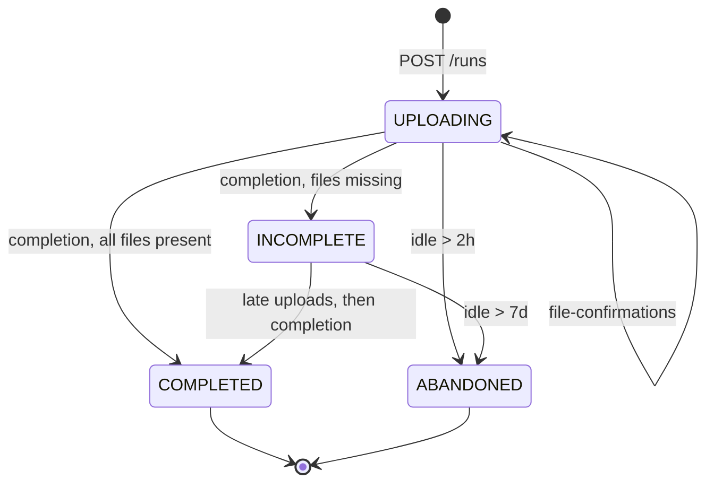

# Design Note - Drone Data Ingestion Pipeline

**Working assumptions.** ~18 000 files / ~40 GB per run: a five-band multispectral sensor over ~3 600 waypoints, ~2.2 MB per frame, so plain `PUT` and no multipart needed. Image bytes go straight to S3 and never transit the API; the API only ever handles metadata. Site uplink is slow and flaky, so an upload window of several hours is normal, not a symptom. A *run* is one inspection session, not one flight: capturing ~18 000 frames takes hours, well past a multirotor's endurance, so a run typically spans several battery swaps. Nothing in the model tracks individual flights, because what matters downstream is the complete set of frames for a site at a date.

## 1. API contract

Auth: `X-API-Key` header, one key per drone, hashed at rest. The key resolves the drone, so no drone identifier is ever trusted from the request body.

| Purpose         | Route                                       | Notes                                                                                                                                                                                                 |
| --------------- | ------------------------------------------- | ----------------------------------------------------------------------------------------------------------------------------------------------------------------------------------------------------- |
| Create run      | `POST /v1/runs`                             | Body: `drone_run_uid` (client UUID), `operator`, `started_at`, `files[] {key, size_bytes}`. Returns run id, status, upload prefix, first batch of presigned URLs. `201` on create, `200` on replay. |
| Get upload URLs | `POST /v1/runs/{run_id}/upload-urls`        | Body: up to 500 file keys. Returns fresh presigned `PUT` URLs.                                                                                                                                        |
| Confirm uploads | `POST /v1/runs/{run_id}/file-confirmations` | Body: up to 1 000 `{key, size_bytes}`. Returns `confirmed_count` / `expected_count`.                                                                                                                  |
| Complete run    | `POST /v1/runs/{run_id}/completion`         | Body: `defect_detected`, `defect_count`, `confidence_score`. Verifies against the bucket, sets final status, returns missing and unverified keys (truncated).                                |
| List runs       | `GET /v1/runs`                              | Filters: `site_id`, `drone_id`, `started_from`/`started_to`, `defect`. Ordered by `confidence_score DESC`. Keyset pagination.                                                             |

**Idempotency.** The drone generates `drone_run_uid` once per run and resends it on retry. `UNIQUE (drone_id, drone_run_uid)` plus `INSERT ... ON CONFLICT DO NOTHING` then read-back: a retry returns the same run with freshly minted URLs (they expire, so regenerating is correct, not a workaround). Confirmations are an `UPDATE` of pre-existing manifest rows guarded by `confirmed_at IS NULL`, so a replayed batch matches nothing and moves no counter. A key the run never declared cannot create a row; it comes back in `unknown_keys`. Completion writes analysis results **once**: a second call re-reconciles files and may promote the status, but never overwrites `defect_detected` / `defect_count` / `confidence_score`. On regulated data, a result that silently changes after the fact is worse than a missing file. `reconciled_at` is tracked separately from `completed_at`.

**Errors.** `401` bad key, `404` unknown run, `409` run already `ABANDONED`, `413` batch over cap, `422` validation, `500` run_lookup_failed (unreachable by construction, raised rather than dereferencing a null). Body: `{error_code, message, details}`.

**Why a fifth endpoint.** Presigning all 18 000 URLs up front is roughly 8 MB of JSON against MinIO, where a signed URL runs to about 350 characters, and closer to 12 MB against S3, where credential scoping makes them longer. Most would expire before the drone reached them. Handing them out in batches keeps responses small and URLs fresh, for one small endpoint. The alternative (a single presigned POST policy scoped to `runs/{id}/` with a `starts-with` condition) covers the whole run in one document and keeps the endpoint count at four, at the cost of a `multipart/form-data` client. Rejected here for client simplicity.

## 2. Data model

```sql
sites(id, name)
drones(id, serial_number UNIQUE, model, last_seen_at)

runs(
  id, drone_id → drones, site_id → sites,   -- stated per mission, then frozen
  drone_run_uid, status, operator,
  started_at, completed_at, reconciled_at, last_activity_at,
  expected_file_count, confirmed_file_count, total_size_bytes,
  defect_detected bool, defect_count int, confidence_score numeric(4,3),
  UNIQUE (drone_id, drone_run_uid)
)

run_files(run_id → runs, file_key, size_bytes, confirmed_at,
          PRIMARY KEY (run_id, file_key))
```

One deliberate denormalization and one modelling choice. `site_id` lives on `runs` because the site belongs to the mission, not to the aircraft: a drone inspects a viaduct one day and a wind farm the next, so there is no standing drone-to-site link to join through. It is stated at creation and never updated, which also makes it a point-in-time fact rather than a reference that could be rewritten later. Results live on `runs` rather than in a separate table: the relation is 1-1 and written once, so a mandatory join buys nothing. `confirmed_file_count` is a counter maintained in the same transaction as each batch, avoiding a `COUNT(*)` over 18 000 rows on every reconciliation.

```sql
CREATE INDEX idx_runs_defective
  ON runs (site_id, started_at DESC, confidence_score DESC)
  WHERE defect_detected;
```

Partial index: only defective runs are indexed, which is the minority and the only case the query asks for, so the index stays small. Equality on site first, then the date range, so the scan narrows to the few hundred rows in the window before anything else happens. The plan still sorts: a range predicate on `started_at` stops the same index from also delivering rows ordered by confidence, and sorting that many rows is free. Leading with confidence instead, to avoid the sort, measured eight times slower. Pagination is keyset on `(confidence_score, id)` rather than `OFFSET`, which degrades on deep pages.

`run_files` carries no secondary index. It is written in bulk and read only as an aggregate during reconciliation, so the composite primary key is enough.

## 3. Upload coordination

The manifest sent at creation defines what is _expected_; `last_activity_at` is the only signal for whether a run is still _alive_. The manifest alone can never distinguish a drone that died at 3 000/18 000 from one that is merely slow.



`INCOMPLETE` is transitory, not terminal. Re-flying an inspection means a pilot
back on site, a weather window and sometimes an overflight clearance, and the
structure may have changed in the meantime, so the capture is not reproducible
in any useful sense. Losing a run because the link dropped on the last few files
would be indefensible, and allowing late uploads costs almost nothing.

The sweep measures silence, not elapsed time. 40 GB over a 20 Mbps site
uplink is ~4.5 h of legitimate uploading, and ~18 h at 5 Mbps, so any
duration-based cut-off would kill healthy runs on the slowest sites. A drone
that is uploading at all confirms a batch of 500 files well inside two hours on
any link, so two hours of complete silence means something is broken. The
counter-intuitive result is that the threshold gets _shorter_ while the system
gets _more_ tolerant of slow links.

| From         | Idle for | To          |
| ------------ | -------- | ----------- |
| `UPLOADING`  | 2 h      | `ABANDONED` |
| `INCOMPLETE` | 7 d      | `ABANDONED` |

The second threshold is wide on purpose: results are already recorded and
recovering the missing files may need someone travelling back to the site.

A stricter variant would compare `confirmed_file_count` between two sweeps and
abandon only when it has not moved, which detects absence of _progress_ rather
than absence of _traffic_. Not implemented: the idle threshold captures nearly
all of it for one column.

The sweep is a plain `UPDATE ... WHERE status = ? AND last_activity_at < now() - interval ?`, exposed as an admin endpoint; a scheduler is deployment concern, not application code.

**Source of truth.** A confirmation is a claim, not a fact: the bytes go
straight to S3, so the API can be told a file arrived when it never did, and a
run marked `COMPLETED` on that basis would report an asset as inspected when
part of it was never seen. Completion therefore reconciles against the bucket, via one
`ListObjectsV2` over the run prefix (~18 paginated calls, seconds against hours
of upload, no queue or worker to operate).

That leaves confirmations doing what they are actually good for: a progress
signal feeding `last_activity_at`, and the cursor for issuing the next batch of
URLs. It also separates two faults their count conflates - files never
confirmed mean an unfinished upload, files confirmed but absent mean a drone
whose view of reality is wrong, which is reported separately.

S3 event notifications into a queue would do the same job continuously rather
than once, and would catch a failed upload mid-run instead of at the end. Worth
it when the requirement becomes early detection; at 18 000 events per run it is
real infrastructure for a guarantee the listing already provides.

## Deliberately out of scope

Preprocessing of the image payload, key rotation, per-site rate limiting, and any retention or archival policy for `run_files`. The last one is the first thing that breaks at scale: 200 drones at 5 runs/day is ~18 M rows/day, and the fix is collapsing terminal runs into an aggregate once reconciled, since per-file detail has no value afterwards.
